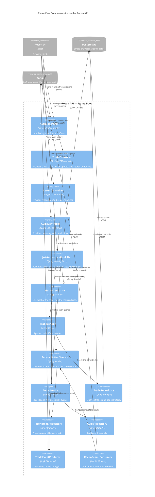

# C4 Component Diagram — Recon API

```mermaid
C4Component
    title ReconX — Components inside the Recon API

    Container_Ext(ui, "Recon UI", "React", "Browser client.")
    ContainerDb_Ext(database, "PostgreSQL", "Trade and reconciliation data.")
    ContainerQueue_Ext(events, "Kafka", "Trade and reconciliation event topics.")

    Container_Boundary(api, "Recon API — Spring Boot") {
        Component(authController, "AuthController", "Spring REST controller", "Handles login and token refresh.")
        Component(tradeController, "TradeController", "Spring REST controller", "Provides trade create, read, update, and search endpoints.")
        Component(reconController, "ReconController", "Spring REST controller", "Provides reconciliation-break endpoints.")
        Component(auditController, "AuditController", "Spring REST controller", "Provides read-only audit endpoints.")

        Component(jwtFilter, "JwtAuthenticationFilter", "Spring security filter", "Validates a JWT and creates the security context.")
        Component(authorisation, "Method security", "Spring Security", "Checks that the caller has the required role.")

        Component(tradeService, "TradeService", "Spring service", "Applies trade lifecycle rules.")
        Component(reconService, "ReconciliationService", "Spring service", "Coordinates matching and break resolution.")
        Component(auditService, "AuditService", "Spring service", "Records and retrieves audit events.")

        Component(tradeRepository, "TradeRepository", "Spring Data JPA", "Queries trades and applies filters.")
        Component(breakRepository, "ReconBreakRepository", "Spring Data JPA", "Queries reconciliation breaks.")
        Component(auditRepository, "AuditRepository", "Spring Data JPA", "Reads audit records.")

        Component(eventProducer, "TradeEventProducer", "KafkaTemplate", "Publishes trade changes.")
        Component(resultConsumer, "ReconResultConsumer", "@KafkaListener", "Consumes reconciliation results.")
    }

    Rel(ui, jwtFilter, "Sends authenticated requests", "HTTPS / JWT")
    Rel(jwtFilter, authorisation, "Establishes caller identity", "Spring Security")
    Rel(ui, authController, "Signs in and refreshes tokens", "HTTPS")
    Rel(ui, tradeController, "Manages trades", "HTTPS / JSON")
    Rel(ui, reconController, "Views and resolves breaks", "HTTPS / JSON")
    Rel(ui, auditController, "Views audit history", "HTTPS / JSON")

    Rel(tradeController, tradeService, "Invokes trade operations")
    Rel(reconController, reconService, "Invokes reconciliation operations")
    Rel(auditController, auditService, "Invokes audit queries")
    Rel(tradeService, tradeRepository, "Reads and saves trades")
    Rel(reconService, breakRepository, "Reads and saves breaks")
    Rel(auditService, auditRepository, "Reads audit events")
    Rel(tradeRepository, database, "Persists trades", "JDBC")
    Rel(breakRepository, database, "Persists breaks", "JDBC")
    Rel(auditRepository, database, "Reads audit records", "JDBC")
    Rel(tradeService, eventProducer, "Emits trade changes")
    Rel(eventProducer, events, "Publishes trade-events", "Kafka protocol")
    Rel(resultConsumer, events, "Consumes recon-results", "Kafka protocol")
    Rel(resultConsumer, reconService, "Applies matching results")
```
