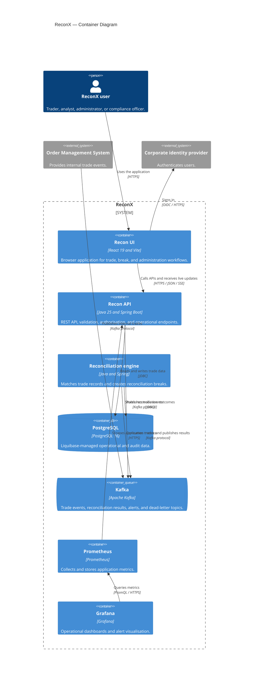

# C4 Container Diagram — ReconX

```mermaid
C4Container
    title ReconX — Container Diagram

    Person(user, "ReconX user", "Trader, analyst, administrator, or compliance officer.")
    System_Ext(oms, "Order Management System", "Provides internal trade events.")
    System_Ext(identity, "Corporate identity provider", "Authenticates users.")

    System_Boundary(reconxBoundary, "ReconX") {
        Container(ui, "Recon UI", "React 19 and Vite", "Browser application for trade, break, and administration workflows.")
        Container(api, "Recon API", "Java 25 and Spring Boot", "REST API, validation, authorisation, and operational endpoints.")
        Container(engine, "Reconciliation engine", "Java and Spring", "Matches trade records and creates reconciliation breaks.")
        ContainerDb(database, "PostgreSQL", "PostgreSQL 16", "Liquibase-managed operational and audit data.")
        ContainerQueue(events, "Kafka", "Apache Kafka", "Trade events, reconciliation results, alerts, and dead-letter topics.")
        Container(metrics, "Prometheus", "Prometheus", "Collects and stores application metrics.")
        Container(dashboards, "Grafana", "Grafana", "Operational dashboards and alert visualisation.")
    }

    Rel(user, ui, "Uses the application", "HTTPS")
    Rel(ui, identity, "Signs in", "OIDC / HTTPS")
    Rel(ui, api, "Calls APIs and receives live updates", "HTTPS / JSON / SSE")
    Rel(oms, events, "Publishes internal trades", "Kafka protocol")
    Rel(api, database, "Reads and writes trade data", "JDBC")
    Rel(api, events, "Publishes trade events", "Kafka protocol")
    Rel(engine, events, "Consumes trades and publishes results", "Kafka protocol")
    Rel(engine, database, "Stores reconciliation outcomes", "JDBC")
    Rel(metrics, api, "Scrapes application metrics", "HTTPS")
    Rel(dashboards, metrics, "Queries metrics", "PromQL / HTTPS")
```
