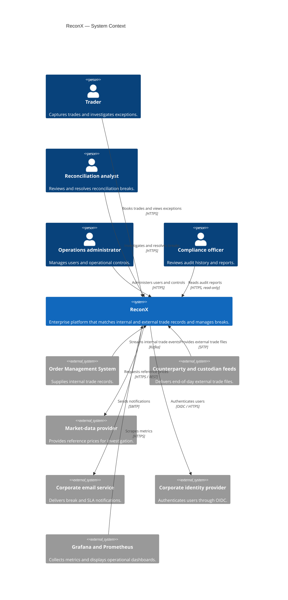

# C4 Context Diagram — ReconX

```mermaid
C4Context
    title ReconX — System Context

    Person(trader, "Trader", "Captures trades and investigates exceptions.")
    Person(analyst, "Reconciliation analyst", "Reviews and resolves reconciliation breaks.")
    Person(admin, "Operations administrator", "Manages users and operational controls.")
    Person(compliance, "Compliance officer", "Reviews audit history and reports.")

    System(reconx, "ReconX", "Enterprise platform that matches internal and external trade records and manages breaks.")

    System_Ext(oms, "Order Management System", "Supplies internal trade records.")
    System_Ext(custodian, "Counterparty and custodian feeds", "Delivers end-of-day external trade files.")
    System_Ext(marketData, "Market-data provider", "Provides reference prices for investigation.")
    System_Ext(email, "Corporate email service", "Delivers break and SLA notifications.")
    System_Ext(identity, "Corporate identity provider", "Authenticates users through OIDC.")
    System_Ext(observability, "Grafana and Prometheus", "Collects metrics and displays operational dashboards.")

    Rel(trader, reconx, "Books trades and views exceptions", "HTTPS")
    Rel(analyst, reconx, "Investigates and resolves breaks", "HTTPS")
    Rel(admin, reconx, "Administers users and controls", "HTTPS")
    Rel(compliance, reconx, "Reads audit reports", "HTTPS, read-only")

    Rel(oms, reconx, "Streams internal trade events", "Kafka")
    Rel(custodian, reconx, "Provides external trade files", "SFTP")
    Rel(reconx, marketData, "Requests reference prices", "HTTPS / REST")
    Rel(reconx, email, "Sends notifications", "SMTP")
    Rel(reconx, identity, "Authenticates users", "OIDC / HTTPS")
    Rel(observability, reconx, "Scrapes metrics", "HTTPS")
```
