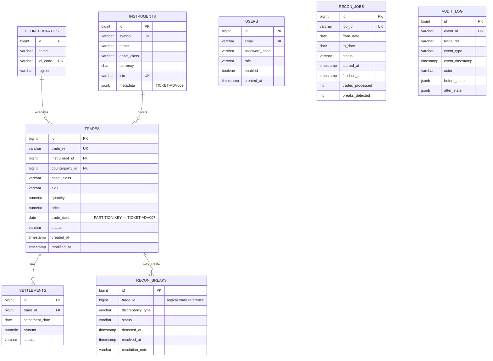

# TICKET-ADV006 — ReconX entity-relationship model

`SETTLEMENTS.trade_id` and `RECON_BREAKS.trade_id` are logical relationships.
PostgreSQL cannot enforce a single-column foreign key to the partitioned
`trades` parent because its primary key is `(id, trade_date)`. `AUDIT_LOG.actor`
also deliberately has no database foreign key so audit data survives record
deletion.
