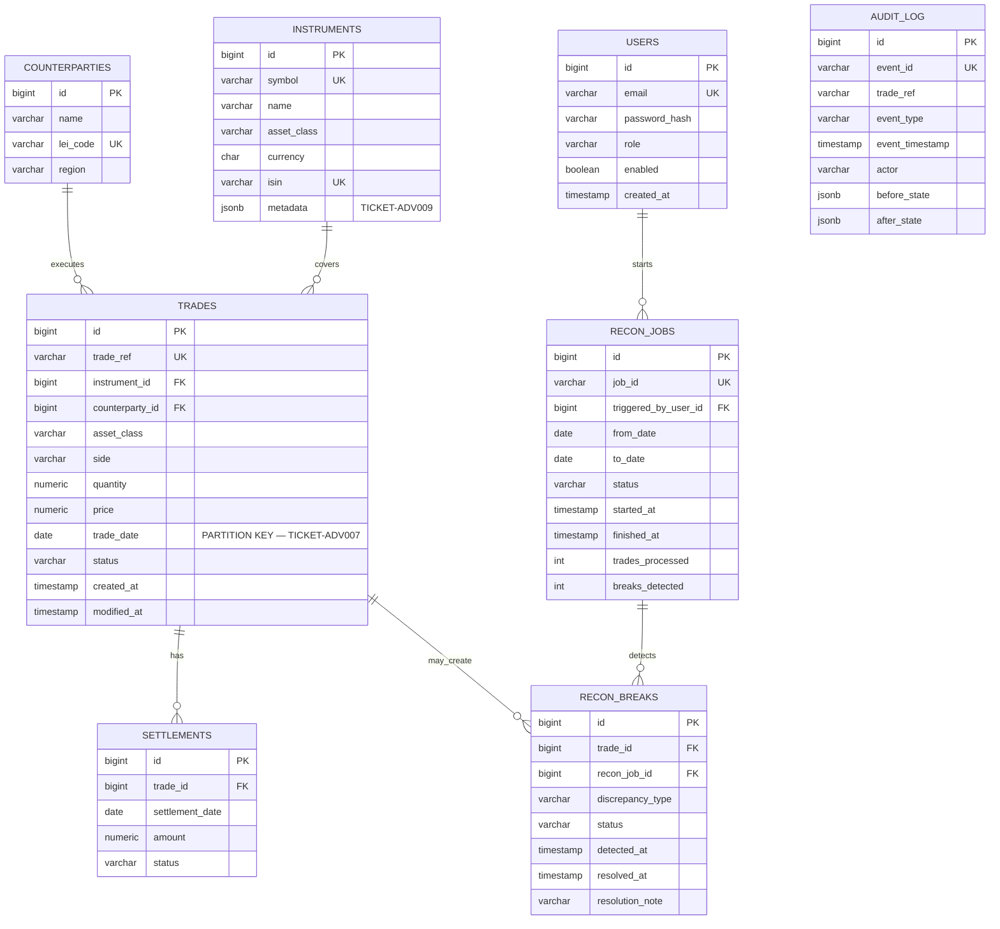

# TICKET-ADV006 — ReconX entity-relationship model

`AUDIT_LOG.actor` deliberately has no database foreign key: audit data must
remain available even if the referenced user or business record is removed.
